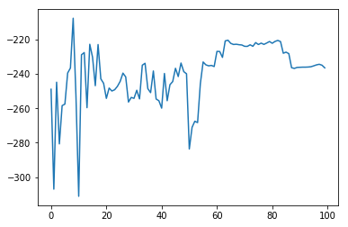

# Teach Quadcopter How To Fly
*Author:* **Pawel Piela**
*Date:* **13/4/2018**

## Project
The goal of this project is to build an *agent* which has to learn how to steer four of the quadcopter's propellers that way so it moves to the *target* position.
The simulator operates in *continous action space*. It accepts multidimensional input (position in $R^3$ and/or additional information like velocities). An output is a vector in $R^4$ with an information for each of the propellers about their rotations per minute rates.

### Algorigthm
I have chosen a DDPG (Deep Deterministic Policy Gradients) algorithm after being able to successfully appy it to other continous action space problems from **OpenAI Gym** (pendulum and mountain car).

DDPG algorithm uses an Actor/Critic architecture with slow updating copies of actor and critic variables to ensure better convergence. Slow copies are not trainable. After the end of each episode slow targets are updated with original actor and target variables. The complete algorithm is avaliable on [arxiv website](https://arxiv.org/pdf/1509.02971.pdf). I decided to use the TensorFlow library thanks to it's ability to calculate gradients easily.

### Model
I use *neural networks* for both Actor and Critic. Actor takes a state as an input to produce action, critic takes both actor and state to produce Q-value (expected return). I have added dropout layers and L2 regularizations to prevent overfitting. The models look as follows:

#### Actor
|Name|Size|Activation|Dropout|
|--|--|--|--|
|Input|6|||
|Hidden Layer|64|ReLU|0.2|
|Hidden Layer|64|ReLU|0.5|
|Hidden Layer|64||0.5|
|Output|4|Sigmoid|

#### Critic
|Name|Size|Activation|Dropout|
|--|--|--|--|
|Input|6+4|||
|Hidden Layer|64|ReLU|0.2|
|Hidden Layer|64|ReLU|0.5|
|Hidden Layer|64|ReLU|0.5|
|Output|1|||

### Hyper Parameters:
|Name|Value|
|--|--|
|Batch Size|1024|
|Replay Buffer Size|1e5|
|$$\gamma$$ (discount factor)|0.99|
|$$\tau$$ (slow targets update rate)|1e-2|
|Actor's Learning Rate|1e-5|
|Critic's Learning Rate|1e-4|
|Actor's L2 factor|1e-7|
|Critic's L2 factor|1e-7|

## Training

The agent explores the environment up to the 70th episode when it discovers the "optimal" policy. After that it keeps getting the same rewards. After 90th episode total reward drops, probably thanks to the overfitting. The average score for the last 30 episodes is `-228.862`.

## Reflections

The hardest part of this project was to understand the foundations of the reinforcement learning and how to use more advanced features of TensorFlow libraries to calculate and apply custom gradients. "Reinforcement Learning: An Introduction" by Sutton and Barto helped me to understand the basic terminology and algorithms in RL. I also took inspiration from OpenAI gym winning algorithms. I have tried to apply Prioritized Replay Buffer to this project, but it could not improve the results much, instead the code was getting harder to read. I have found that the problems in multidimensional action-space are much harder to be solved than one-dimensional action-space problems from OpenAI website.

